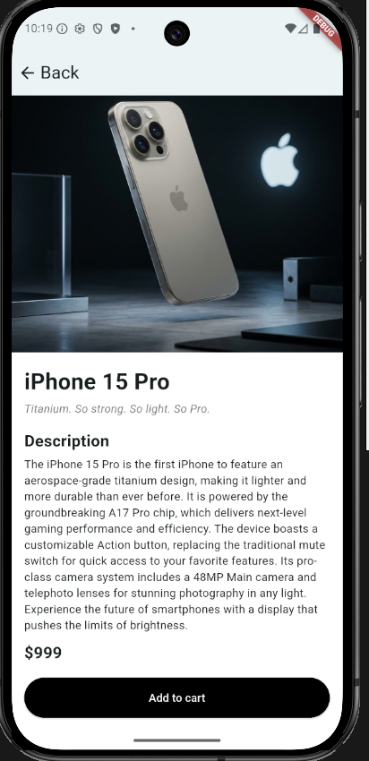
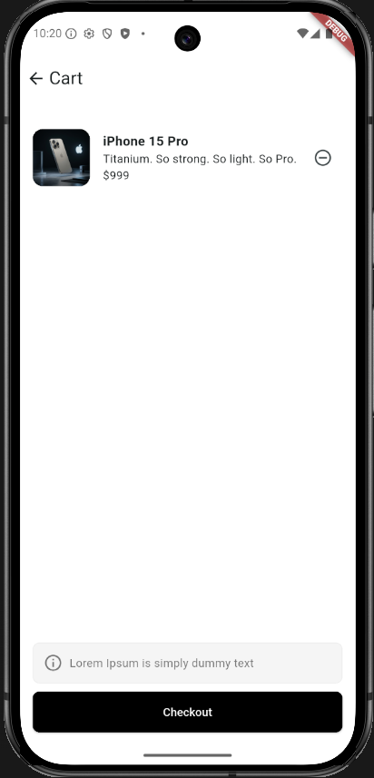
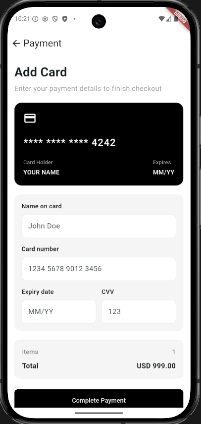
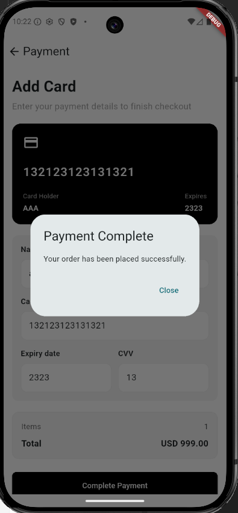

# E-Commerce Software Persona

Flutter ile geliştirilmiş, ürün listeleme, arama, sepet yönetimi ve ödeme akışı sunan modern bir e-ticaret demo uygulamasıdır.

## Repository URL

[https://github.com/ahmetkync/E-Commerce-Software-Persona](https://github.com/ahmetkync/E-Commerce-Software-Persona)

## Kullanılan Flutter Sürümü

- Flutter `3.41.4`
- Dart `3.11.1`

## Özellikler

- Uzak API üzerinden ürünleri listeleme
- Ürün arama ve filtreleme
- Ürün detay sayfası
- Sepete ürün ekleme ve çıkarma
- Ödeme ekranı ve sipariş tamamlama akışı

## Çalıştırma Adımları

```bash
flutter pub get
flutter run
```

İsteğe bağlı kalite kontrolleri:

```bash
flutter analyze
flutter test
```

## Ekran Görüntüleri

### 1. Ana Sayfa


### 2. Ürün Detay



### 3. Sepet



### 4. Kart Bilgileri



### 5. Sipariş Başarılı


